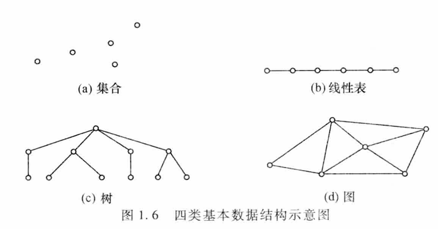
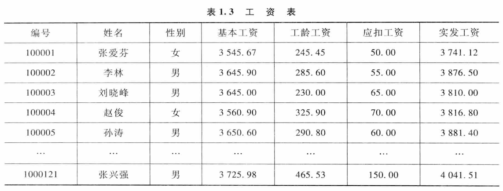
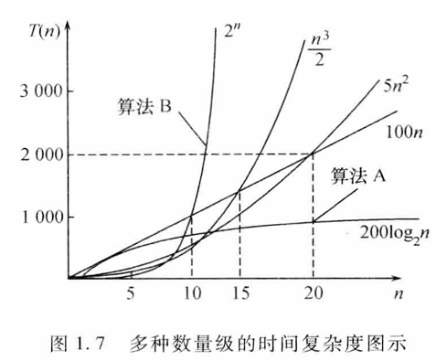

# 1.1 数据结构的基础概念
1. 数据(Data)：数据是描述客观事物的数值、字符以及能输入机器且能被处理的各种符号集合
2. 数据元素(Data Element)：数据元素是组成数据的基本单位，是数据集合的个体
3. 数据对象(Data Object)：数据对象是性质相同的数据元素的集合，是数据的一个子集
4. 数据结构 (Data Structure)：数据结构是指相互之间存在一种或多种特定关系的数据元素集合
5. 数据类型(Data Type)：数据类型是一组性质相同的值集合以及定义在这个值集合上的一组操作的总称
6. 抽象数据类型：抽象的本质是抽取反映问题的本质点，而忽略非本质的细节，这是从事计算机研究的重要方法
抽象数据类型最重要的特点是数据抽象与信息隐蔽
# 1.2 数据结构的内容
## 逻辑结构
   数据的逻辑结构是指数据元素之间逻辑关系描述。数据结构的形式定义为：数据结构是一个二元组 $Data\_Struclure = ( D, R)$
   其中，D 是数据元素的有限集，R 是 D 上关系的有限集
   根据数据元素之间关系的不同特性，通常有下列四类基本结构：
	1. 集合结构：结构中的数据元素之间除了同属于一个集合的关系外，无任何其他关系
	2. 线性结构：结构中的数据元素之间存在着一对一的线性关系
	3. 树状结构：结构中的数据元素之间存在着一对多的层次关系
	4. 图状结构或网状结构：结构中的数据元素之间存在着多对多的任意关系 
	   
   由于集合中关系只有属于或不属千这种简单的属于关系，可以用其他的结构代替它，故数据 的四类基本逻辑结构可概括如下：
   $$
\text{逻辑结构}\begin{cases}
\text{线性结构——线性表、栈、队、字符串 、数组、广义表}\\
\text{非线性结构——树、图}
\end{cases}
$$
## 存储结构
   存储结构（又称物理结构）是逻辑结构在计算机中的存储映像形式化描述：
   对于一种数据结构 $(D,R)$ ，要将 D存入计算机中，建立一种从 D 的数据元素到存储空间 M 单元的映像 S, 即 $D\to M$，也就是说对于每一个 $d, d\in D$，都有唯一的 $z \in M$ 使 $S(D)=Z$, 同时这个映像必须明显或隐含地体现关系 R
   数据元素之间的关系在计算机中有两种不同的表示方法
   - 顺序映像（顺序存储结构）
   - 非顺序映像（非顺序存储结构）
## 运算集合
   
   在表 1. 3 所示工资表中，采用了线性表的**逻辑结构**，因为结点与结点之间是一种简单的线性关系；由于工资表可能包括几千名职工信息，可采用顺序结构存放，也可采用非顺序结构存放。怎么存放就是具体**存储结构**的间题了。对千工资表，当职工调离时要删除相应的数据元素，调进时要增加数据元素，调整工资时要修改数据元素。这里的增、删、改就是数据的**操作集合**
综上所述，数据结构的内容可归纳为三个部分：逻辑结构、存储结构和运算集合。 **按某种逻 辑关系组织起来的一批数据，按一定的映像方式把它们存放在计算机的存储器中，并在这些数据 上定义一个运算的集合**，这些是数据结构课程的基本内容。
# 1.3 算法
##  算法定义
   算法(Algorithm)是规则的有限集合，是为解决特定问题而规定的一系列操作。
## 算法的特性
   1. 有限性：有限步骤之内正常结束，不能形成无穷循环
   2. 确定性：算法中的每一个步骤必须有确定含义，无二义性
   3. 可行性：原则上能精确进行，操作可通过已实现的基本运算执行有限次而完成
   4. 输入：有多个或0个输入
   5. 输出：至少有一个或多个输出
  在算法的五大特性中，最基本的是有限性、确定性和可行性这三个特性
## 算法设计的要求
   当用算法来解决某问题时，算法设计的目标是正确、可读、健壮、高效、低耗。通常作为一个好的算法，一般应该具有以下几个基本特征
   1. 算法的正确性
	   1. 算法对于几组输入数据能够得出满足要求的结果
	   2. 算法对于精心选择的典型、苛刻而带有刁难性的输入数据能够得出满足要求的结果
	   3. 算法对于一切合法的输入数据都能产生满足要求的结果
   2. 可读性
   3. 健壮性（鲁棒性）：对非法输入的抵抗能力
   4. 高效率和低存储量：算法的效率通常是指算法的执行时间，存储量需求是指算法在执行过程中所需要的最大存储空间
# 1.4 算法描述
## 算法、语言、程序的关系
1. 算法：描述数据对象之间的关系（包括数据逻辑关系、存储关系描述）。 
2. 描述算法的工具：算法可用自然语言、框图或高级程序设计语言进行描述。自然语言简单但易产生二义性；框图直观但不擅长表达数据的组织结构；而高级程序设计语言则较为准确、严谨，但因需考虑细节问题而显得相对烦琐。 
3. 程序是算法在计算机中的实现（与所用计算机及所用语言有关）。程序设计的实质是对实际问题选择一种好的数据结构，加之设计一个好的算法，而好的算法在很大程度上取决千描述实际问题的数据结构。
## 设计实现算法过程的步骤
1. 找出与求解有关的数据元素之间的关系（建立结构关系）
2. 确定在某一数据对象上所施加的运算
3. 考虑数据元素的存储表示
4. 选择描述算法的语言
5. 设计实现求解的算法，并用程序语言加以描述。
## 描述算法的语言选择
~~写 cpp 就得了哪来那么多废话~~
# 1.5 算法性能评价
1. 性能评价
	   对问题规模与该算法在运行时所占用空间与所耗费时间给出一个数量关系的评价
	   数量关系评价体现在时间上，即算法经编程实现后在计算机中运行所耗费的时间
	   数量关系评价体现在空间上，即算法经编程实现后在计算机中运行所占用的存储量
2. 问题规模
    问题规模是问题大小的本质表示，对不同的问题其表现形式不同，算法求解问题的输入拭称为问题的规模，一般用整数表示
## 1.5.1 算法的时问性能分析
1. 算法耗费的时间
	   一个算法的执行时间是指算法中所有语句执行时间的总和。 每条语句的执行时间等千该条 语句的执行次数乘以执行一次所需实际时间
2. 语句频度
	   语句频度是指该语句在一个算法中重复执行的次数。一个算法的时间耗费就是该算法中所有语句频度之和
3. 算法的时间复杂度
	   为便于比较解决同一问题的不同算法，通常以算法中基本操作重复执行的频度作为度鼠标准。基本操作是指从算法中选取一种对所研究问题是基本运算的操作，用随着问题规模增加的函数来表征，以此作为时间量度
	   算法的时间复杂度 $T(n)$ 是该算法的时间度撮，记作 $T(n) = 0 (f(n))$ 它表示随间题规模 n 的增大，算法的执行时间的增长率和 $f(n)$ 的增长率相同，称作算法的渐近时间复杂度，简称**时间复杂度**
4. 渐近时间复杂度
	   由于算法执行的实际机器时间难以精确统计，因此主要考虑用算法时间复杂度的数最级 （即算法的渐近时间复杂度）来评价一个算法的时间性能
5. 常用算法时间复杂度
	   数据结构中常用的时间复杂度频率计数有以下7种： $O(1)$ 常数型，$O(n)$ 线性型，$O(n^2)$ 平方型，$O(n^3)$ 立方型，$O(2")$ 指数型，$O(log_2 N$）对数型，$O(nlog_2 n)$ 二维型
	   不同数址级的时间复杂度的形状如图 1. 7 所示，一般情况下，随 n 的增大，T(n)的增长较慢的算法为最优算法，因此应该选择使用多项式阶 $0(n^k )$ 的算法，而避免使用指数阶的算法
	   

6. 常用渐进时间复杂度阶（由低到高）

| 复杂度 | 名称 | 典型场景 |
|---|---|---|
| O (1) | 常数阶 | 哈希表随机访问 |
| O (log n) | 对数阶 | 折半查找、平衡树查找 |
| O (n) | 线性阶 | 顺序查找、遍历 |
| O (n log n) | 线性对数阶 | 快排、归并、堆排 |
| O (n²) | 平方阶 | 简单排序、 Floyd 最外层 |
| O (n³) | 立方阶 | 矩阵乘法经典版 |
| O (2ⁿ) | 指数阶 | 暴力子集、旅行商暴力 |
| O (n!) | 阶乘阶 | 全排列暴力 |

7. 最好 / 最坏 / 平均情况  
- 最好 T_best (n)：输入规模 n 下最乐观的执行步数  
- 最坏 T_worst (n)：算法在任何规模为 n 的输入上最多步数，通常写 O 时默认指最坏  
- 平均 T_avg (n)：对所有可能输入的期望步数，需已知输入分布  

8. 主定理（Master Theorem）  
对分治递推式  
T (n) = a·T (n/b) + f (n)，a≥1，b>1  
9. 若 f (n)=O (n^{log_b a-ε})，则 T (n)=Θ(n^{log_b a})  
10. 若 f (n)=Θ(n^{log_b a})，则 T (n)=Θ(n^{log_b a} log n)  
11. 若 f (n)=Ω(n^{log_b a+ε}) 且满足正则条件，则 T (n)=Θ(f (n))

## 1.5.2 算法的空间性能分析

1. 空间复杂度 S (n) = 算法在运行过程中所需“辅助存储”与“输入规模 n”的渐进关系  
2. 只计算**额外**占用的空间，输入数据本身占的 n 个单元不计入  
3. 常见场景  
- 原地工作：O (1) 额外空间（如冒泡排序）  
- 线性额外：O (n)（如归并排序合并数组）  
- 递归栈：递归深度 × 单次帧大小，如快速排序平均 O (log n)，最坏 O (n)

# 1.6 渐进符号体系（Asymptotic Notation）

| 符号 | 数学定义 | 含义 |
|---|---|---|
| O (g) | ∃c>0, n₀, ∀n≥n₀, 0≤f (n)≤c·g (n) | 上界（最坏） |
| Ω(g) | ∃c>0, n₀, ∀n≥n₀, 0≤c·g (n)≤f (n) | 下界（最好） |
| Θ(g) | f (n)=O (g) 且 f (n)=Ω(g) | 紧确界 |
| o (g) | lim_{n→∞} f (n)/g (n)=0 | 非紧上界 |
| ω(g) | lim_{n→∞} f (n)/g (n)=∞ | 非紧下界 |

# 1.7 算法设计常用策略

| 策略 | 核心思想 | 经典例子 |
|---|---|---|
| 分治 | 分而治之，合并结果 | 归并排序、二分查找 |
| 动态规划 | 最优子结构 + 重叠子问题 | 0-1 背包、LCS |
| 贪心 | 局部最优 ⇒ 全局最优 | Prim、Dijkstra（非负权） |
| 回溯 | 深度优先 + 剪枝 | N 皇后、子集和 |
| 分支限界 | 广度优先 + 上下界剪枝 | 旅行商、作业调度 |
| 随机化 | 利用随机数加速/避免最坏 | 快排随机主元、Karger 最小割 |
