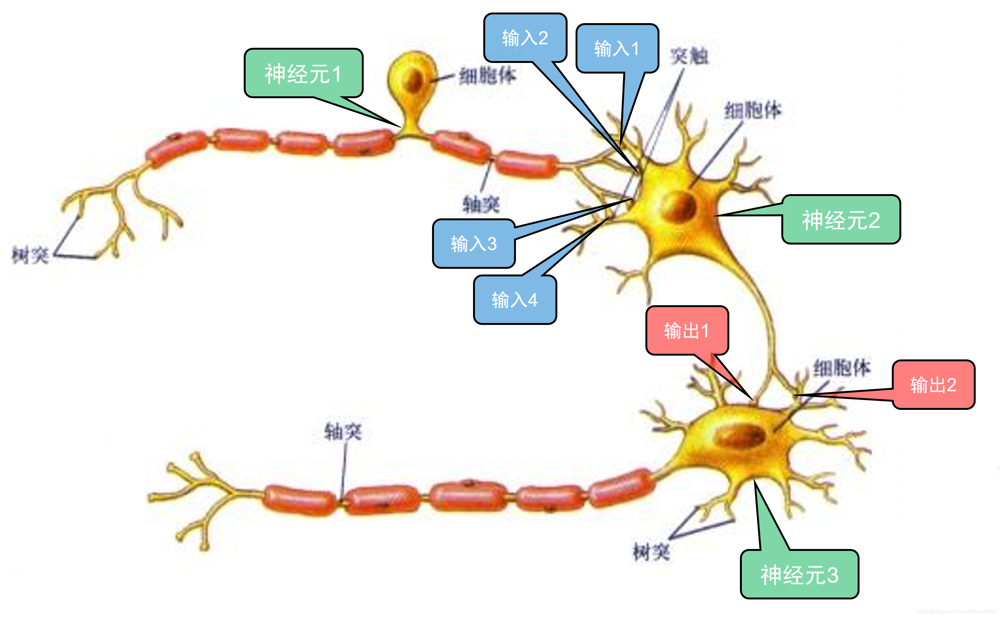
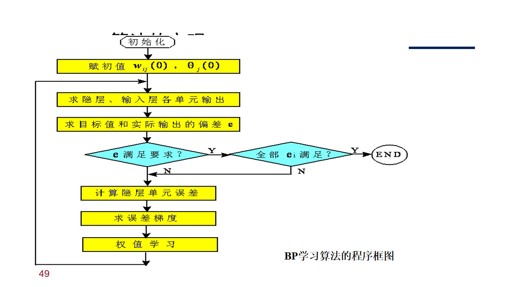

# 8.1 神经元与神经网络
## 8.1.1 生物神经元结构

## 8.1.2 神经元数学模型

神经元数学模型可由以下三部分组成：
- 加权求和
- 线性动态系统
- 非线性函数

$y_i(t)$为第i个神经元的输出，$\theta_{i}$为第i个神经元的阈值，$u_k(t)$为外部输入$a_{ij}，b_{ik}$为权值
$$
v_{i}(t)=\sum_{j=1}^{N}a_{ij}y_{j}(t)+\sum_{k=1}^{M}b_{ik}u_{k}(t)-\theta_{i}
$$
- 矩阵形式
$$
v(t)=Ay(t)+Bu(t)−θ
$$

线性环节的传递函数描述为
$$
X_{i}(s)=H(s)V_{i}(s)
$$
## 8.1.3 神经网络的结构与工作方式
### 1. 神经网络的结构
1. 前馈型
2. 反馈型
### 2. 神经网络的工作方式
## 8.1.4 神经网络的学习
# 8.2 BP神经网络
## 8.2.1 BP神经网络的结构
1. **分层结构​**​
    
    - ​**​输入层​**​：负责接收外部数据。神经元个数由输入数据的特征维度决定（如图像的像素数、数据的指标数）。该层仅传递数据，不进行加权求和与激活。
        
    - ​**​隐藏层​**​：介于输入层和输出层之间，是神经网络的“大脑”，负责进行特征抽象和转换。可以有一层或多层（超过一层可称为深度神经网络）。每个神经元都会进行​**​加权求和​**​并通过​**​激活函数​**​产生输出。
        
    - ​**​输出层​**​：网络最终的输出结果。神经元个数由任务决定（如分类的类别数、回归值的个数）。同样，每个神经元也会进行加权求和与激活。
    
2. ​**​前馈连接​**​
    
    信号​**​单向​**​从输入层流向输出层，同一层的神经元之间没有连接，每个神经元只与下一层的所有神经元全连接。这种结构就是“前馈”。
    
3. ​**​权重与偏置​**​
    
    连接每个神经元的线都有一个​**​权重​**​，每个神经元（除输入层外）都有一个​**​偏置​**​。这些权重和偏置就是神经网络需要学习的​**​参数​**​。训练BP网络的过程，本质上就是通过反向传播算法来调整这些权重和偏置的值，以使网络的输出接近真实值。
    
4. ​**​激活函数​**​
    
    每个隐藏层和输出层的神经元都包含一个​**​激活函数​**​（如Sigmoid, ReLU, Tanh）。它的作用是引入非线性，使得网络可以拟合非常复杂的非线性关系。如果没有激活函数，无论网络有多少层，都等价于一个单层线性模型。
## 8.2.2 BP学习算法
**万能近似定理​**​ 在数学上证明了：​**​一个只包含一个隐藏层的前馈神经网络，只要隐藏层有足够多的神经元，就可以以任意精度近似任何从一个有限维空间到另一个有限维空间的连续函数。​**​

简单来说：

> 无论你要拟合的函数有多么复杂（比如识别猫狗、预测股价、翻译语言），总存在一个足够大的单隐藏层神经网络，可以像“万能钥匙”一样，无限逼近这个函数。

对于任意给定的连续函数 f:[0,1]n→Rm和任意精度 ϵ>0，

​**​存在一个三层前馈神经网络​**​ N，其结构如下：

1. ​**​输入层​**​：包含 n个神经元，接收输入向量 x=(x1​,x2​,...,xn​)T。
    
2. ​**​单隐藏层​**​：包含 H个神经元（H是一个有限的、足够大的整数）。
    
3. ​**​输出层​**​：包含 m个神经元，产生输出向量 y^​=(y^​1​,y^​2​,...,y^​m​)T。
    
4. ​**​隐藏层激活函数​**​ σ：是一个非线性的、有界的、非常数的连续函数（例如Sigmoid函数）。
    

使得对于所有定义域内的输入 x，神经网络的输出 y^​与目标函数 f(x)的差异小于精度要求：

$$x∈[0,1]nsup​∥N(x)−f(x)∥<ϵ$$

这里，N(x)表示网络对输入 x的计算结果。
BP学习算法使通过反向学习过程使误差最小，因此选择目标函数为
$$
minJ=\frac{1}{2}\sum_{j=1}^{P_{m}}(y_{j}^{m}-y_{sj})^2
$$
神经网络权值的修正量为
$$
\Delta w_{ij}^{k-1}=-\epsilon \ \frac{\partial J}{\partial w_{ij}^{k-1}} (\epsilon > 0)
$$
其中$\epsilon$为学习步长，一般小于0.5
### BP算法的推导
#### 一、网络结构及符号定义
假设我们有一个多层前馈神经网络，包含输入层、一个或多个隐藏层和输出层。我们使用以下符号：

- L：网络的总层数（输入层为第 0 层，输出层为第 L 层）。
    
- k：层的索引，k=0,1,…,L。
    
- $n_k​$：第 k 层的神经元个数。
    
- $x_i^k$​：第 k 层第 i 个神经元的输入（即加权求和后的值）。
    
- $y_i^k$​：第 k 层第 i 个神经元的输出（即经过激活函数后的值）。
    
- $w_ij^k​$：第 k 层第 i 个神经元到第 k+1 层第 j 个神经元的连接权值。
    
- $b_j^{k+1}​$：第 k+1 层第 j 个神经元的偏置。
    
- f(⋅)：激活函数，通常使用 Sigmoid 函数、ReLU 函数等。
    

网络的前向传播过程为：
$$
x_{j}^{k+1}​=i=1\sum _{i=1}^{n_{k}}w_{ij}^{k}y_{i}^{k}​+b_{j}^{k+1}
$$
$$​
y_{j}^{k+1}​=f(x_j^{k+1}​)
$$
#### 二、误差反向传播算法推导
BP 算法的核心思想是：通过计算误差函数对各个权值的偏导数，然后利用梯度下降法来更新权值，使得误差函数最小化。

##### 1. 输出层的误差计算

首先，我们定义输出层的误差信号。对于输出层第 j 个神经元，其误差信号为：

$$
\delta_{j}^{L}=\frac{\partial J}{\partial x_{j}^{L}}.
$$

根据链式法则，我们有：

$$
\delta_{j}^{L}=\frac{\partial J}{\partial y_{j}^{L}}\cdot\frac{\partial y_{j}^{L}}{\partial x_{j}^{L}}
$$

由于$J=\dfrac{1}{2}\sum_{j=1}^{P_{m}}\bigl(y_{j}^{L}-y_{sj}\bigr)^{2}$，且  $P_{m}=n_{L}$，则：

$$
\frac{\partial J}{\partial y_{j}^{L}}=\bigl(y_{j}^{L}-y_{sj}\bigr).
$$

又因为$y_{j}^{L}=f\!\bigl(x_{j}^{L}\bigr)$，所以：

$$
\frac{\partial y_{j}^{L}}{\partial x_{j}^{L}}=f'\!\bigl(x_{j}^{L}\bigr).
$$

因此，输出层的误差信号为：

$$
\delta_{j}^{L}=\bigl(y_{j}^{L}-y_{sj}\bigr)\,f'\!\bigl(x_{j}^{L}\bigr).
$$

##### 2. 隐藏层的误差计算

对于隐藏层（第 k 层，k=1,2,…,L−1），其误差信号可以通过下一层（第 k+1 层）的误差信号反向传播得到。

定义隐藏层第 k 层第 i 个神经元的误差信号为：
$$
\delta_{i}^{k}=\frac{\partial J}{\partial x_{i}^{k}}.
$$
根据链式法则，我们有：
$$
\delta_{i}^{k}=\sum_{j=1}^{n_{k+1}}\frac{\partial J}{\partial x_{j}^{k+1}}\cdot
\frac{\partial x_{j}^{k+1}}{\partial y_{i}^{k}}\cdot
\frac{\partial y_{i}^{k}}{\partial x_{i}^{k}}.
$$
我们知道：

- $\dfrac{\partial J}{\partial x_{j}^{k+1}}=\delta_{j}^{k+1}$
    
- $x_{j}^{k+1}=\sum_{i=1}^{n_{k}}w_{ij}^{k}\,y_{i}^{k}+b_{j}^{k+1}$,
		故 $\dfrac{\partial x_{j}^{k+1}}{\partial y_{i}^{k}}=w_{ij}^{k}$
    
- $y_{i}^{k}=f\!\bigl(x_{i}^{k}\bigr)$,
        故 $\dfrac{\partial y_{i}^{k}}{\partial x_{i}^{k}}=f'\!\bigl(x_{i}^{k}\bigr)$
    

因此，隐藏层的误差信号为：

$$
\delta_{i}^{k}=\Biggl(\,\sum_{j=1}^{n_{k+1}}\delta_{j}^{k+1}\,w_{ij}^{k}\Biggr)\,f'\!\bigl(x_{i}^{k}\bigr)
$$

##### 3. 权值修正量的计算

现在，我们来计算误差函数对权值的偏导数。

对于第 k−1 层第 i 个神经元到第 k 层第 j 个神经元的连接权值  $w_{ij}^{k-1}$，我们有：

$$
\frac{\partial J}{\partial w_{ij}^{k-1}}
=\frac{\partial J}{\partial x_{j}^{k}}\cdot
\frac{\partial x_{j}^{k}}{\partial w_{ij}^{k-1}}.
$$

我们知道：

-  $\dfrac{\partial J}{\partial x_{j}^{k}}=\delta_{j}^{k}$
    
- $x_{j}^{k}=\sum_{i=1}^{n_{k-1}}w_{ij}^{k-1}\,y_{i}^{k-1}+b_{j}^{k}$,
        故 $\dfrac{\partial x_{j}^{k}}{\partial w_{ij}^{k-1}}=y_{i}^{k-1}$
    

因此，误差函数对权值的偏导数为：

$$
\frac{\partial J}{\partial w_{ij}^{k-1}}=\delta_{j}^{k}\,y_{i}^{k-1}.
$$

根据梯度下降法，权值的修正量为：

$$
\Delta w_{ij}^{k-1}=-\epsilon\,\frac{\partial J}{\partial w_{ij}^{k-1}}=-\epsilon\,\delta_{j}^{k}\,y_{i}^{k-1}.
$$

类似地，对于偏置 bjk​，其修正量为：

$$
\Delta b_{j}^{k}=-\epsilon\,\frac{\partial J}{\partial b_{j}^{k}}=-\epsilon\,\delta_{j}^{k}.
$$
## 8.2.3 BP学习算法的实现
1. **初始化**  
    对所有权值与偏置赋小随机数：
    $$
   w_{ij}^{k}\sim\mathcal{U}(-\alpha,\alpha),\quad
   b_{j}^{k+1}\sim\mathcal{U}(-\alpha,\alpha),\quad
   \alpha\ll 1.
    $$
2. **前向传播**（对当前样本）  
    逐层计算
    
    
$$x_{j}^{k+1}=\sum_{i=1}^{n_{k}}w_{ij}^{k}\,y_{i}^{k}+b_{j}^{k+1},\quad
   y_{j}^{k+1}=f\!\bigl(x_{j}^{k+1}\bigr)
$$
 直至得到输出层结果 yjL​。
    
3. **输出层误差**
    
$$
 \delta_{j}^{L}=\bigl(y_{j}^{L}-y_{sj}\bigr)\,f'\!\bigl(x_{j}^{L}\bigr).
$$
4. **反向传播误差**  
    对 k=L−1,L−2,…,1 逐层计算
    
$$
   \delta_{i}^{k}=\Biggl(\,\sum_{j=1}^{n_{k+1}}\delta_{j}^{k+1}\,w_{ij}^{k}\Biggr)\,f'\!\bigl(x_{i}^{k}\bigr).
$$
5. **权值与偏置更新**
    
$$
   \Delta w_{ij}^{k-1}=-\epsilon\,\delta_{j}^{k}\,y_{i}^{k-1},\quad
   w_{ij}^{k-1}\leftarrow w_{ij}^{k-1}+\Delta w_{ij}^{k-1};
$$
$$
   \Delta b_{j}^{k}=-\epsilon\,\delta_{j}^{k},\quad
   b_{j}^{k}\leftarrow b_{j}^{k}+\Delta b_{j}^{k}.
$$
6. **循环控制**
    
    - 对训练集所有样本执行 2–5（完成 1 个 epoch）。
        
    - 重复 epoch 直至
        
$$
     J=\frac12\sum_{j=1}^{P_{m}}\bigl(y_{j}^{L}-y_{sj}\bigr)^{2}\le J_{\text{target}}
$$

或达到最大迭代次数。
        

7. **返回** 训练后的所有权值 {wijk​} 与偏置 {bjk​}。

 ## 8.6 卷积神经网络与深度学习
 BP算法需要巨量的计算量，而局部敏感和方向选择的神经元可以降低计算量
 ### 8.6.1 卷积神经网络的结构
 