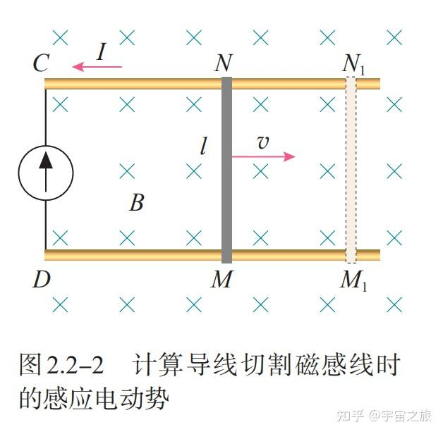

# 14.1 电磁感应定理
## 14.1.1 电磁感应现象
法拉第的实验：
- 磁铁与线圈有相对运动，线圈中产生电流
- 一线圈电流变化，在附近其他线圈中产生电流
电磁感应实验的结论
**当穿过一个闭合导体回路所限定的面积的磁通量产生变化时，回路中就产生电流**，这样的电流叫做**感应电流**
## 14.1.2 电动势
定义：将单位正电荷从电源负极推向电源正极的过程中，非静电力所做的功
$$\epsilon=\frac{W}{q}=\oint_{L}E_{i}·dl$$
## 14.1.3 法拉第电磁感应定律
**感应电动势的大小与通过导体回路的磁通量的变化率成正比**
$$\epsilon=-\frac{d\phi}{dt}$$
**负号表示感应电流的效果总是反抗引起感应电流的原因——楞次定律**
如果有N匝线圈，且穿过每匝的磁通量都相同，则
$$
\epsilon = -\frac{d(N\phi_{m})}{dt}=-\frac{d\Psi}{dt}
$$
式中，$\Psi _{m}=N\Theta_{m}$称为穿过N匝线圈的**全磁通**或**磁通链数**（简称**磁链**）
**楞次定律**：感应电流的方向总是使其激发的磁场**阻碍**引起感应电流的磁通量的变化
如果回路闭合，则有感应电流
$$
I=\frac{\epsilon}{R}=-\frac{1}{R}\frac{d\phi_{m}}{dt}
$$
$t_{1}$到$t_{2}$时间内通过导体回路任一横截面的感应电量
$$
q=\int_{t_{1}}^{t_{2}}Idt=-\frac{1}{R}\int_{\Phi_{m1}}^{\Phi_{m2}}d\Phi_{m}=\frac{1}{R}(\Phi_{m1}-\Phi_{m2})
$$
# 14.2 动生电动势与感生电动势
> 动生电动势：由于导体或导体回路在恒定磁场中作​**​切割磁感线​**​的​**​机械运动​**​而产生的电动势
> 感生电动势：导体或导体回路​**​保持静止​**​，但由于穿过回路的​**​磁场发生变化​**​而产生的电动势
## 14.2.1 动生电动势
$$
\epsilon_{i}=|\frac{d\phi}{dt}|=Blv
$$
单位时间内导线切割的条数

任意t时刻穿过回路所围面积的磁通量为
$$
\Phi_{m}=B·S=-BS=-BLx
$$
由法拉第电磁感应定律，回路中的感应电动势为
$$
\epsilon=-\frac{d\Phi_{m}}{dt}=-\frac{d}{dt}(-BLx)=BL \frac{dx}{dt}=BLv
$$
显然，产生动生电动势的非静电力是**洛伦兹力**
由电动势的定义式，因为此处非静电场的场强
$$
E_{i}=\frac{F_{m}}{-e}=v\times B
$$
所以ab棒上的动生电动势
$$
\epsilon=\int_{-}^{+}E_{i}·dl=\int_{a}^{b}(v\times B)·dl
$$
由于$v\perp B$，且$v\times B$与dl同方向
$$
\epsilon=\int_{a}^{b}(v \times B)·dl=\int_{a}^b
vBdl=BLv$$
## 14.2.2 感生电动势
### 1. 感生电场 感生电动势
随时间变化的磁场会在其周围空间激发一种新的电场，称为**感生电场**或**涡旋电场**，用$E_{i}$表示
#### 感生电场与静电场
- 激发源
	- 静电场：静止的电荷
	- 感生电场：变化的磁场
- 性质
	- 静电场是保守场
	- 感生电场是非保守场
- 电场线
	- 静电场是有源场
	- 感生电场是无源场

产生感生电动势的非静电力就是感生电场对电荷的作用力
在闭合回路L上产生的感生电动势为
$$
\epsilon=\oint_{L}E_{i}·dl=-\frac{d\Phi_{m}}{dt}
$$
对L围成的面积S，磁通量$\Phi_{m}=\int_{S}B·dS$，故
$$
\epsilon=\oint_{L}E_{i}·dl=-\frac{d}{dt}\int_{S}B·dS
$$
如果回路L静止，则$\Phi_{m}$的变化完全由B的变化引起，交换t与S的运算顺序
$$
\epsilon=\oint_{L}E_{i}·dl=-\int_{S} \frac{\partial B}{\partial t}·dS
$$
空间只要存在变化的磁场，就一定伴有感生电场
则上式为**感生电场的环路定理**，也就是**法拉第电磁感应定理的积分形式**
## *14.2.3 电磁感应的应用
1. 交流发电机（旋转电动势） ε(t)=NBAω sinωt （N匝线圈，均匀磁场B，角速度ω）
    
2. 涡流制动/熔炼 导体板以v在磁场B中运动 → 感应涡流密度 j=σ(v×B) 制动力密度 f=j×B= –σvB²（反向与v）
    
3. 变压器（互感应用见§14.3.2）
    
4. 电磁阻尼仪表 铝盘在永磁铁间隙中转动 → 涡流力矩 ∝ ω，实现指针阻尼。
    
5. 感应加热 高频交变磁场 → 工件内涡流功率 P=π²f²B²d²σ/6 （d为薄板厚度，集肤效应显著时修正）
    
6. 速度/位置传感器 霍尔+线圈混合式：ε=–dΦ/dt ∝ v 或 Δx。
# 14.3 自感与互感
## 14.3.1 自感
### 1.自感现象 自感系数
当通过一个回路的电流发生变化时，将引起穿过回路本身所围面积的磁通量发生变化，而在自身回路中产生感应电动势，这种现象称为**自感现象**，所产生的电动势称为**自感电动势**
$$
\Psi_{m}=N\Phi_{m}=LI或L=\frac{N\Phi_{m}}{I}
$$
## 14.3.2 互感
### 1.互感现象 互感系数
$$
\Psi_{21}=N_{2}\Phi_{21}=M_{21}I_{1}
$$
$$
\Psi_{12}=N_{1}\Phi_{12}=M_{12}I_{2}
$$
理论和实践证明，$M_{21}=M_{12}=M$，$M$为两线圈的**互感系数**，简称**互感**，于是上两式简化为
$$
M=\frac{\Psi_{21}}{I_{1}}= \frac{\Psi_{12}}{I_{2}}
$$
### 2.互感电动势
当线圈1中的电流$I_{1}$变化时，在线圈2产生互感电动势
$$
\epsilon_{2}=-\frac{d\Psi_{21}}{dt}=-M\frac{dI_{1}}{dt}
$$
同理，当线圈2中的$I_{2}$变化时，在线圈1产生互感电动势
$$
\epsilon_{1}=-\frac{d\Psi_{12}}{dt}=-M\frac{dI_{2}}{dt}
$$
# 14.4 磁场的能量
## 14.4.1 自感磁能
在电流激发磁场的过程中，外力也要克服由电磁感应引起的感应电动势而做功，从而消耗电源的能量并转化为磁场的能量而储存起来，这部分能量称为**自感磁能**
## 14.4.2 互感磁能
$W_m=½L₁I₁²+½L₂I₂²+MI₁I₂$
推导思路：先给线圈1通电→建立I₁，电源克服自感电动势做功 ½L₁I₁²；再维持I₁不变，给线圈2通电→除 ½L₂I₂² 外，线圈1中还要克服互感电动势 M(dI₂/dt) 做功 MI₁I₂。 
若两线圈反向串联（磁场相消），则M<0，总磁能减小。
# 14.5 麦克斯韦电磁场理论
 > 麦克斯韦提出**有旋电场**和**位移电流**两个假设，从而预言了电磁波的存在
## 14.5.1 位移电流 全电流定律
- 静电场高斯定理
$$
\oint_{S}\vec{D}·d\vec{s}=\int_{V }pdV=\sum q
$$
- 静电场环流定理
$$
\oint_{l}\vec{E}·d\vec{l}=0
$$
- 磁场高斯定理
$$
\oint_{S}\vec{B}·d\vec{s}=0
$$
- 安培环流定理
$$
\oint_{l}\vec{H}·d\vec{l}=\sum I=\int_{S}\vec{j}·ds
$$
### 1.位移电流
稳恒磁场中，安培环路定理如上
对非稳恒磁场，麦克斯韦假设：
- 电场中某一点位移电流密度等于该点电位移矢量对时间的变化率
- 位移电流密度：$\vec{j}_{d}=\frac{\partial \vec{D}}{\partial t}$
将传导电流和位移电流相加，得到合电流$I+I_{d}$（称为**全电流**），则**全电流总是连续的**
### 2.全电流定律
## 14.5.2 电磁场 麦克斯韦方程组的积分形式
1. $\oint_S D·dS = Σq₀$ （电高斯：自由电荷 q₀ 是 D 场源）
    
2.  $∮_S B·dS = 0$ （磁高斯：无磁单极）
    
3. $∮_L E·dl = –∫_S (∂B/∂t)·dS$ （法拉第：变化磁生电）
    
4. $∮_L H·dl = ∫_S (j_c + ∂D/∂t)·dS$ （麦克斯韦-安培：变化电生磁）
# 14.6 电磁波
1. 真空波动方程 ∇²E – μ₀ε₀ ∂²E/∂t²=0，同理对 B。 波速 c=1/√(μ₀ε₀)=3.00×10⁸ m/s。
    
2. 平面简谐波（沿+z） E=E₀ cos(kz–ωt) x̂ B=B₀ cos(kz–ωt) ŷ 关系：B₀=E₀/c，k=ω/c。
    
3. 能量与能流 能量密度 w=½(ε₀E²+B²/μ₀)=ε₀E² 坡印廷矢量 S=E×H，大小 |S|=EB/μ₀=E²/(μ₀c) 平均辐射强度 I=½ε₀cE₀²。
    
4. 动量与辐射压 对完全吸收面 p_r=w，辐射压 P=I/c； 对完全反射面 P=2I/c。
    
5. 典型计算 例 太阳光常数 S̄≈1.36 kW/m²，求 E₀、B₀。 解 E₀=√(2S̄/ε₀c)=1.01 kV/m，B₀=E₀/c=3.4 μT。
    
6. 产生与传播 LC 振荡→偶极天线（λ≈4l）→远场辐射功率 P=μ₀p₀²ω⁴/(12πc)，其中 p₀ 为电偶极矩振幅。
