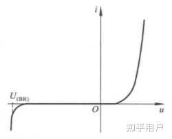
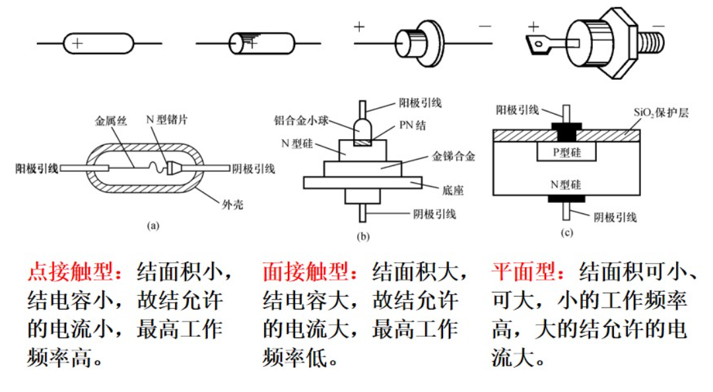
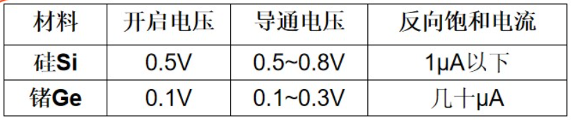
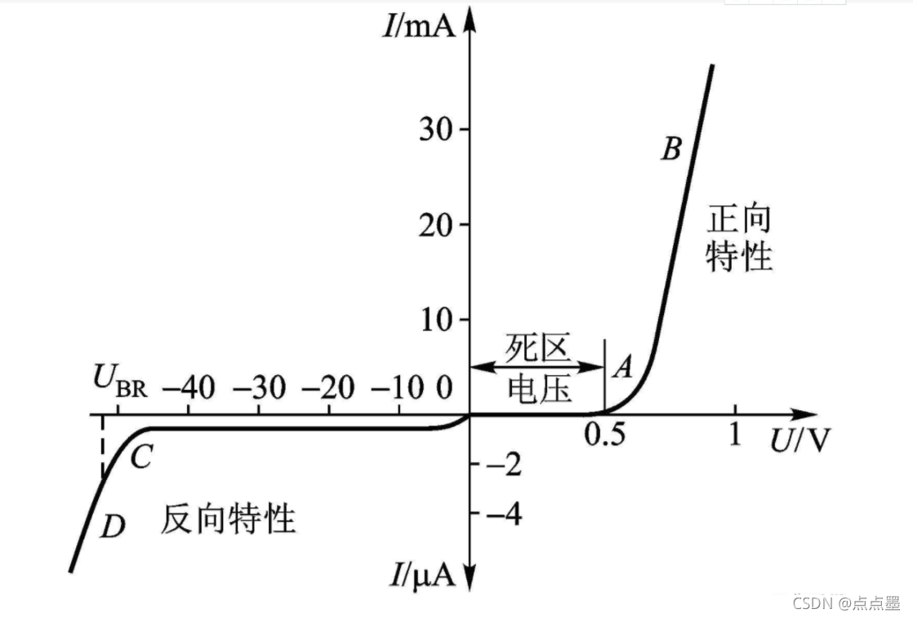
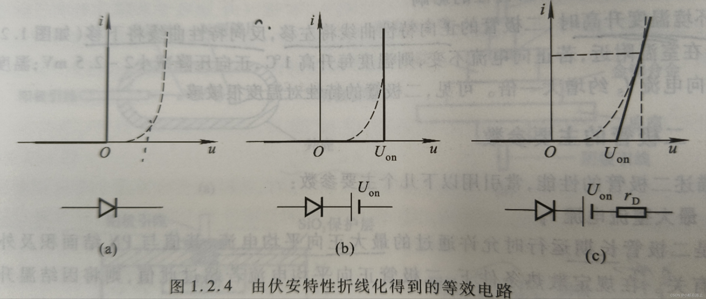
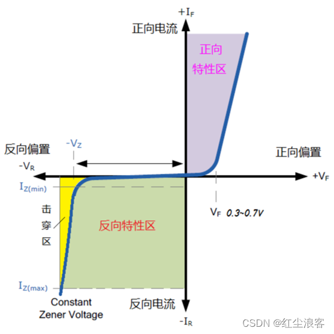
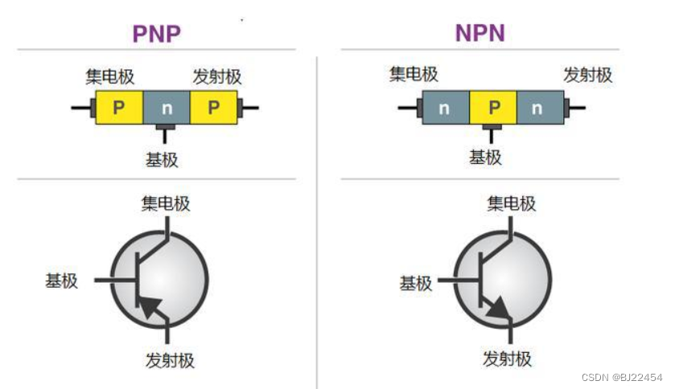
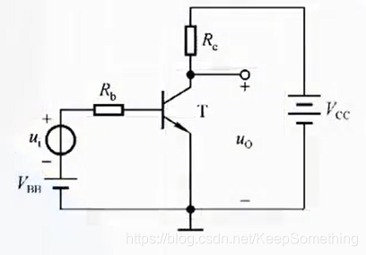
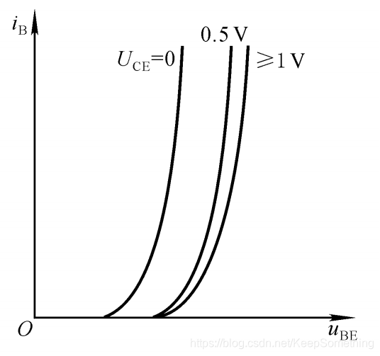
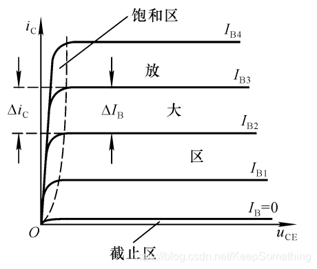

# 1.1 半导体基础知识

> 半导体器件是构成电子电路的基本元件

---

## 1.1.1 本征半导体

### 一、半导体

半导体：导电性介于导体与绝缘体之间的物质

| 特性               | 导体（金属等）     | 绝缘体（惰性气体、橡胶等） | 半导体（四价元素）                    |
| ------------------ | ------------------ | -------------------------- | ------------------------------------- |
| 价电子             | 1～2 个（低价）    | ≥7 个或满壳层（高价）      | 4 个                                  |
| 禁带宽度 Eg        | 0 eV（重叠）       | ≥5 eV                      | 0.7～1.5 eV（Si:1.12 eV，Ge:0.66 eV） |
| 载流子浓度 (300 K) | 10²²～10²³ cm⁻³    | <10³ cm⁻³                  | 10¹⁰～10¹⁶ cm⁻³（本征约 10¹⁰ cm⁻³）   |
| 电阻率 (300 K)     | 10⁻⁸～10⁻⁶ Ω·cm    | 10¹⁴～10²² Ω·cm            | 10²～10⁹ Ω·cm                         |
| 电导机制           | 自由电子           | 几乎无自由载流子           | 电子+空穴（本征或掺杂）               |
| 温度影响           | 电阻↑（晶格散射↑） | 电阻略↓（但仍极高）        | 电阻↓（本征激发↑，少子剧增）          |
| 掺杂效应           | 几乎不变           | 几乎不变                   | 浓度、类型可控（P/N 型）              |
| 常见材料           | Cu、Al、Ag、Na     | 惰性气体、橡胶、玻璃、石英 | Si、Ge、GaAs、C（金刚石结构）         |
| 应用               | 导线、电极         | 封装、绝缘支撑、护套       | 二极管、晶体管、集成电路              |

**本征半导体**：纯净的晶体结构的半导体

### 二、本征半导体的晶体结构

本征半导体（纯硅或锗）的晶体结构是**金刚石型**：每个原子与四个最近邻原子以sp³杂化轨道形成四面体共价键，键角109.5°，在三维空间无限延伸，构成高度对称、完全电中性的立方晶格。

### 三、本征半导体中的两种载流子

由于热运动，拥有足够能量的价电子挣脱共价键的束缚而成为**自由电子**

当价带中的一个电子被激发（如受热、光照或掺杂）离开原位，留下一个**电子空位**，这个空位即称为**空穴**。

### 四、本征半导体中载流子的浓度

**本征激发**：半导体在热激发下产生自由电子和空穴对的现象

**复合**：自由电子在运动的过程中如果与空穴相遇就会填补空穴，使两者同时消失

**动态平衡**：在一定温度下，本征激发所产生的自由电子和空穴对，与复合的自由电子与空穴对数目相等

本征半导体载流子的浓度为$n_{i}=p_{i}=K_{i}T^{\frac{3}{2}}e^{\frac{-E_{GO}}{(2kT)}}$

| 符号     | 名称         | 定义                                     | 常用单位   |
| -------- | ------------ | ---------------------------------------- | ---------- |
| $n_i$    | 本征电子浓度 | 本征半导体中单位体积内的导带电子数       | cm⁻³       |
| $p_i$    | 本征空穴浓度 | 本征半导体中单位体积内的价带空穴数       | cm⁻³       |
| $K_i$    | 本征浓度系数 | 与材料有效态密度、普适常数有关的综合常数 | cm⁻³ K⁻³/² |
| $T$      | 绝对温度     | 晶格热力学温度                           | K          |
| $E_{GO}$ | 0 K 禁带宽度 | 绝对零度时导带底与价带顶的能量差         | eV         |
| $k$      | 玻尔兹曼常数 | $1.380649\times10^{-23}$ J·K⁻¹           | J·K⁻¹      |

- 本征半导体的导电性能很差，且与环境温度密切相关

## 1.1.2 杂质半导体

在本征半导体中掺入少量合适的杂质元素，便可得到**杂质半导体**

### 一、N型半导体

**N型半导体**：在纯净的硅晶体中掺入**五价**元素

- N型半导体中，自由电子的浓度大于空穴的浓度，故称自由电子为**多数载流子**，空穴为**少数载流子**；简称前者为**多子**，后者为**少子**，由于杂质原子可以提供电子，故称之为**施主原子**

- N型半导体主要靠自由电子导电，掺入的杂质越多，自由电子的浓度越高，导电性能也就越强

### 二、P型半导体

**P型半导体**：在纯净的硅晶体中掺入**三价**元素

- P型半导体中，自由电子的浓度小于空穴的浓度，故称自由电子为**少数载流子**，空穴为**多数载流子**，由于杂质原子中的空位可以吸收电子，故称之为**受主原子**

## 1.1.3 PN结

**PN结**：采用不同的掺杂工艺，将P型半导体和N型半导体制作在同一块硅片上

- PN结具有**单向导电性**

### 一、PN结的形成

把P型（多子空穴）和N型（多子电子）半导体贴在一起，因浓度差，多子互相扩散，留下带电的杂质离子，形成内建电场；电场反过来把少子拉回去，最终扩散流与漂移流相等，系统达到平衡，就在界面处形成了具有内建电势和空间电荷区的PN结

### 二、PN结的单向导电性

1. PN结外加**正向电压**时处于**导通**状态
	- 耗尽层**变窄**，扩散运动**加剧**，由于外电源的作用，形成扩散电流，PN结处于导通状态

2. PN结外加**反向电压**时处于**截止**状态
	- 耗尽层**变宽**，**阻止**扩散运动，有利于漂移运动，形成漂移电流。由于电流很小，故可近似认为其截止

### 三、PN结的电流方程

由理论分析可知，PN结所加端电压$u$与流过它的电流$i$的关系为$i=I_{s}(e^{\frac{qu}{kT}-1})$

式中$I_{s}$为**反向饱和电流**，$q$为电子的电量，$k$为玻尔兹曼常数，$T$为热力学温度

将${\frac{kT}{q}}$用$U_{T}$取代，则得$i=I_{s}(e^{\frac{u}{U_{T}}-1})$

### 四、PN结的伏安特性

### 五、PN结的电容效应

# 1.2 半导体二极管

> 将PN结用外壳封装起来，并加上电极引线就构成了半导体二极管，简称二极管

## 1.2.1 半导体二极管的几种常见结构

## 1.2.2 二极管的伏安特性

二极管的电流与其端电压的关系称为伏安特性

$i=f(u)$ 	$i=I_{s}(e^{\frac{u}{U_{T}}-1})$

在外加正向电压相同的情况下，二极管的正向电流要小于PN结的电流

由于二极管表面漏电流的存在，使外加反向电压时的反向电流增大，反向电压太大将使二极管击穿

1. 单向导电性
	- 若正向电压$u>>U_{T}$，则$i\approx I_{S}e^{\frac{u}{U_{T}}}$，正向特性为指数曲线
	- 若反向电压$|u|>>U_{T}$，则$i\approx -I_{s}$，反向特性为横轴的平行线

2. 伏安特性受温度影响
	- 在环境温度升高时，二极管的正向特性曲线将左移，反向特性曲线将下移
	- 在室温附近，若正向电流不变，则温度每升高1°C，正向压降减小2~2.5mV；温度每升高10°C，反向电压$I_{S}$约增大一倍

## 1.2.3 二极管的主要参数

### 一、最大整流电流$I_{Y}$

- **定义**：二极管在长时间工作时，允许通过的最大正向平均电流。
- **意义**：反映二极管承受正向电流的能力。
- **注意**：超过此值可能导致二极管过热损坏。

### 二、最高反向工作电压 $U_{R}$

- **定义**：二极管在正常工作时，所能承受的最大反向电压。
- **意义**：确保二极管在反向偏置下不被击穿。
- **注意**：实际工作电压应远低于此值，以保证安全。

### 三、反向电流 $I_{R}$

- **定义**：在规定的反向电压下，流过二极管的反向漏电流。
- **意义**：反映二极管的单向导电性能。
- **特点**：
	- 硅管：反向电流较小（纳安级别）。
	- 锗管：反向电流较大（微安级别）。
- **温度影响**：温度升高，反向电流显著增加。

### 四、最高工作频率$f_{M}$

- **定义**：二极管能正常工作的最高信号频率。
- **意义**：超过此频率，二极管将失去单向导电性。
- **影响因素**：主要由结电容大小决定，结电容越小，*f**M* 越高。

## 1.2.4 二极管的等效电流

能够模拟二极管特性的电路称为二极管的**等效电路**，也称为二极管的**等效模型**

### 一、由伏安特性折线化得到的等效电路

**理想二极管**：相当于理想开关，使用空心的二极管符号来表示

### 二、二极管的微变等效电路

当二极管外加直流正向电压时，将有一直流电流，曲线上反映该电压和电流的点为Q点，称为静态工作点。

若在Q点基础上外加微小的变化量，则可以用以Q点为切点的直线来近似微小变化时的曲线，即将二极管等效为一个动态电阻，称之为二极管的微变等效电路，或称之为交流等效模型

## 1.2.5 稳压二极管

稳压二极管时一种硅材料制成的面接触型晶体二极管，简称稳压管

### 一、稳压管的伏安特性

稳压器的伏安特性与普通二极管类似，正向特性为指数曲线。当稳压管外加反向电压的数值大到一定程度时则击穿，击穿区的曲线很陡，几乎平行于纵轴，表现其具有稳压的特性。只要控制反向电流不超过一定值，管子就不会因过热而损坏

### 二、稳压管的主要参数

1. 稳定电压$U_{Z}$：$U_{Z}$是在规定电流下稳压管的反向击穿电压
2. 稳定电流$I_{Z}$：$I_{Z}$是稳压管工作在稳压状态时的参考电流
3. 额定功耗$P_{ZM}$：$P_{ZM}$等于稳压管的稳定电压$U_{Z}$与**最大稳定电流$I_{ZM}$** 的乘积
4. 动态电阻$r_{Z}$：$r_{Z}$是稳压管工作在稳压区时，端电压变化量与其电流变化量之比
5. 温度系数$\alpha$:$\alpha$表示温度每变化1℃稳压值的变化量，即$\alpha=\frac{\Delta U_{Z}}{\Delta T}$
- 由于稳压管的反向电流小于$I_{Zmin}$时不稳压，大于$I_{Zmax}$时会因超过额定功耗而损坏，故在稳压管电路中必须串联一个**限流电阻**来限制电流，从而保证稳压管正常工作
## 1.2.6 其他类型二极管
### 一、发光二极管
### 二、光电二极管
# 1.3 晶体三极管
> 晶体三极管中有两种带有不同极性电荷的载流子参与导电，故称之为双极性晶体管（BJT）
## 1.3.1 晶体管的结构与类型
根据不同的掺杂方式在同一个硅片上制造出三个掺杂区域，并形成两个PN结，就构成晶体管

## 1.3.2 晶体管的电流放大作用

如图基本共射放大电路中，$\Delta u_{1}$为输入电压信号，接入基极-发射极回路，称为输入回路；放大后的信号在集电极-发射极回路，称为输出回路。由于发射极是两个回路的公共端，故称该电路为**共射放大电路**
**使晶体管工作在放大状态的外部条件是发射结正向偏置且集电结反向偏置**
因而在输入回路需加基极电源$V_{BB}$；在输出回路需加集电极电源$V_{CC}$；$V_{BB}$和$V_{CC}$的极性如图所示
### 一、晶体管内部载流子的运动
当$\Delta u_{I}=0$时，晶体管内部载流子运动示意图如图

### 二、晶体管的电流分配关系

### 三、晶体管的共射电流放大系数

## 1.3.3 晶体管的共射特性曲线
###  一、输入特性曲线
输入特性曲线描述管压降$U_{CE}$一定的情况下，基极电流$i_{B}$与发射结压降$U_{BE}$之间的函数关系，即
$i_{B}=f(u_{BE})$ | $_{U_{CE}为常数}$
当$U_{CE}=0V$时，相当于集电极与发射极短路，即发射结与集电结并联，输入特性曲线与PN结的伏安特性曲线相似，呈指数关系
当$U_{CE}$增大时，由发射区注入基区的非平衡少子有一部分越过基区和集电结形成的集电极电流$i_{C}$，使得在基区参与复合运动的非平衡少子随$U_{CE}$的增大而减小，因此曲线将右移

### 二、输出特性曲线
输出特性曲线描述基极电流$I_{B}$为某一常量时，集电极电流$i_{C}$与管压降$U_{CE}$之间的函数关系，即$i_{C}=f(u_{CE})$ | $_{I_{B}=常数}$

#### 晶体管的三个工作区域
1. 截止区：发射结电压小于开启电压且集电结反向偏置。**$u_{BE}\leq U_{on}$且$u_{CE}>u_{BE}$**。此时$I_{B}=0$，近似认为$i_{C}\approx0$
2. 放大区：发射结正向偏置且集电结反向偏置，$u_{BE}\geq U_{on}$且$u_{CE}>u_{BE}$，此时，$i_{c}$几乎仅取决于$i_{B}$，而与$u_{CE}$无关，表现出$i_{B}$对$i_{c}$的控制作用
3. 饱和区：发射结与集电结均处于正向偏置，
## 1.3.4 晶体管的主要参数
## 1.3.5 温度对晶体管特性及参数的影响
## 1.3.6 光电二极管