# 2.1 放大的概念和放大电路的主要性能指标
## 2.1.1 放大的概念
放大电路放大的本质是**能量的控制和转换**
电子电路放大的基本特征是**功率放大**
能够控制能量的元件称为**有源器件**
放大的前提是不失真，即只有在不失真的情况下放大才有意义
## 2.1.2 放大电路的性能指标
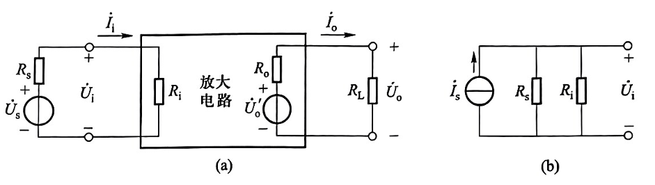
### 一、放大倍数
放大倍数是直接衡量放大电路放大能力的重要指标，其值为输出量$\dot{X_{o}}(\dot{u_{o}}或\dot{I_{o}})$与输入量$\dot{X_{i}}(\dot{u_{i}}或\dot{I_{i}})$之比。
电压放大倍数是输出电压 $\dot{U_{o}}$。与输入电压$\dot{U_{i}}$之比，记作$\dot{A}_{uu}$
$$\dot{A}_{uu}=\dot{A}_{u}=\frac{\dot{U_{o}}}{\dot{U_{i}}}$$
电流放大倍数是输出电流 $\dot{I}_{o}$与输入电流$\dot{I}_{\mathrm{i}}$之比，记作 
$$
\dot{A}_{\mathrm{ii}}=\dot{A}_{\mathrm{i}}=\frac{\dot{I}_{\mathrm{o}}}{\dot{I}_{\mathrm{i}}}
$$
电压对电流的放大倍数是输出电压 $\dot{U}_{\mathrm{o}}$ 与输入电流 $\dot{I}_{\mathrm{i}}$ 之比，记作 
$$
\dot{A}_{\mathrm{ui}}=\frac{\dot{U}_{\mathrm{o}}}{\dot{I}_{\mathrm{i}}}（Ω）
$$
电流对电压的放大倍数是输出电流 $\dot{I}_{\mathrm{o}}$ 与输入电压 $\dot{U}_{\mathrm{i}}$之比，记作 
$$
\dot{A}_{\mathrm{iu}}=\frac{\dot{I}_{\mathrm{o}}}{\dot{U}_{\mathrm{i}}}（S）
$$
### 二、输入电阻
放大电路与信号源相连接就成为信号源的负载，必然从信号源索取电流，电流的大小表明放大电路对信号源的影响程度
输入电阻$R_{i}$是从放大电路输入端看进去的等效电阻，定义为输入 电压有效值$U_{i}$和输入电流有效值$I_{i}$之比，即
$$
R_{i}=\frac{U_{i}}{I_{i}}
$$
### 三、输出电阻
任何放大电路的输出都可以等效成一个有内阻的电压源，从放大电路输出端看进去的等效内阻称为输出电阻$R_{o}$。$U_{o}'$为空载时输出电压的有效值，$U_{o}$为带负载后输出 电压的有效值，因此
$$
U_{o}=\frac{R_{L}}{R_{o}+R_{L}}·U_{o}'
$$
输出电阻
$$
R_{o}=\left( \frac{U_{o}'}{U_{o}}-1 \right)R_{L}
$$
测量时令 U_s=0（信号源短路）、R_L→∞
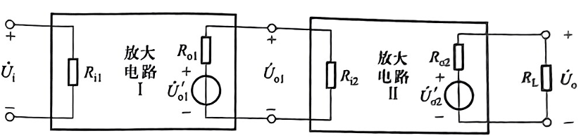
### 四、通频带
$BW = f_H − f_L$，其中
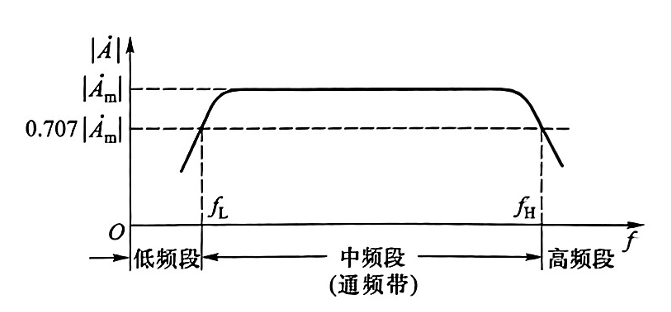
### 五、非线性失真系数
### 六、最大不失真输出电压
# 2.2 基本共射放大电路的工作原理
## 2.2.1 基本共射放大电路的组成及各元件的作用
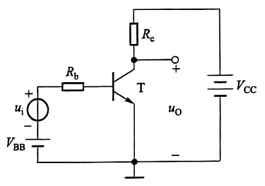
## 2.2.2 设置静态工作点的必要性
### 一、静态工作点
Q 点：$(I_BQ, I_CQ, U_CEQ)$,
### 二、为什么要设置静态工作点
对于放大电路的最基本要求，一是不失真，二是能够放大
## 2.2.3 基本共射放大电路的工作原理及波形分析
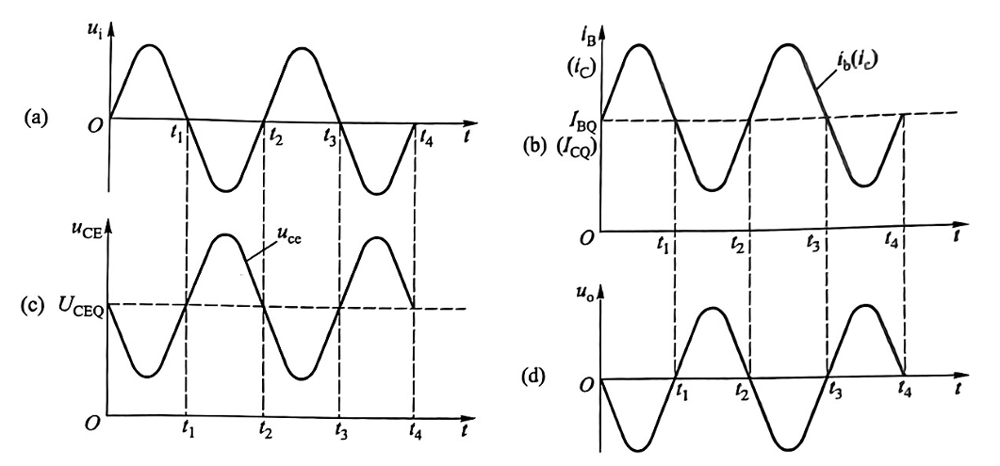
## 2.2.4 放大电路的组成原则
### 一、组成原则
1. 必须根据所用放大管的类型提供直流电源，以便设置合适的静态工作点，并作为输出的能源
2. 电阻取值得当，与电源配合，使放大管有合适的静态工作点
3. 输入信号必须能够作用于放大管的输入回路
4. 当负载接入时，必须保证放大管输出回路的动态电流(晶体管的$\Delta i_{C}、\Delta i_{E}$或场效应管的$\Delta i_{D}、\Delta i_{S}$)能够作用于负载，从而使负载获得比输入信号大得多的信号电流或信号电压。
### 二、两种实用的共射放大电路
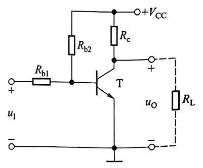
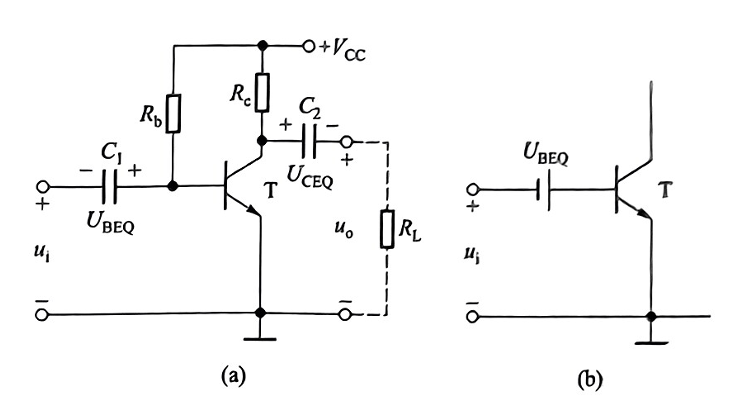
# 2.3 放大电路的分析方法
> 分析放大电路就是在理解放大电路工作原理的基础上求解静态工作点和各项动态参数
## 2.3.1 直流通路与交流通路
**直流通路**是在**直流电源**作用下**直流电流**流经的**通路**，也就是静态电流流经的通路，用于研究静态工作点
**交流通路**是**输入信号**作用下**交流信号**流经的**通路**，用于研究动态参数
1. 直流通路：
	1. $u_{S}$=0，保留$R_s$;
	2. 电容开路
	3. 电感相当于短路（线圈电阻近似为0）
2. 交流通路
	1. 大容量电容相当于短路
	2. 直流电源相当于短路（内阻为0）
## 2.3.2 图解法
### 一、静态工作点的分析
> 图解二元方程

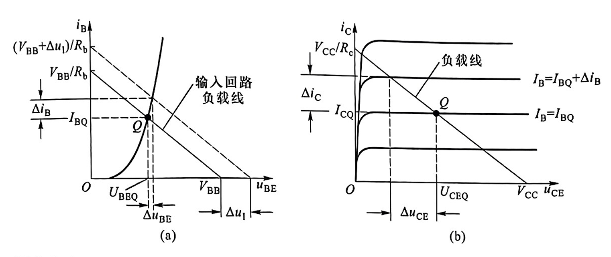
$$
u_{BE}=V_{BB}-i_{B}R_{b}
$$
$$
u_{CE}=V_{CC}-i_{C}R_{c}
$$
### 二、电压放大倍数的分析
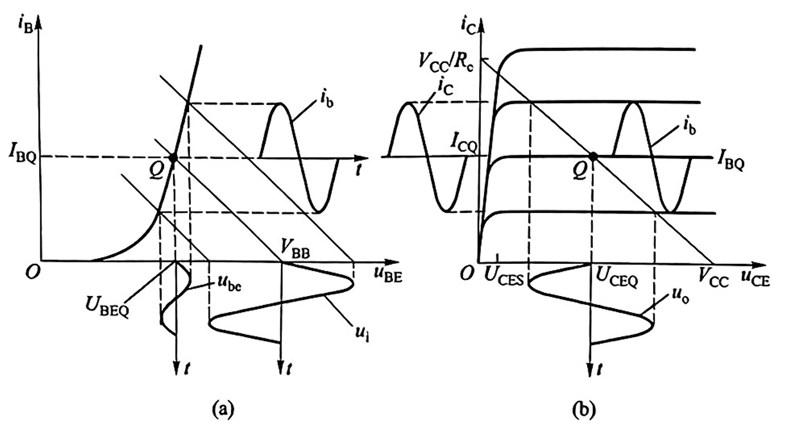
$$
u_{BE}=V_{BB}+\Delta u_{1}-i_{B}R_{b}
$$
### 三、波形非线性失真的分析
#### 截止失真
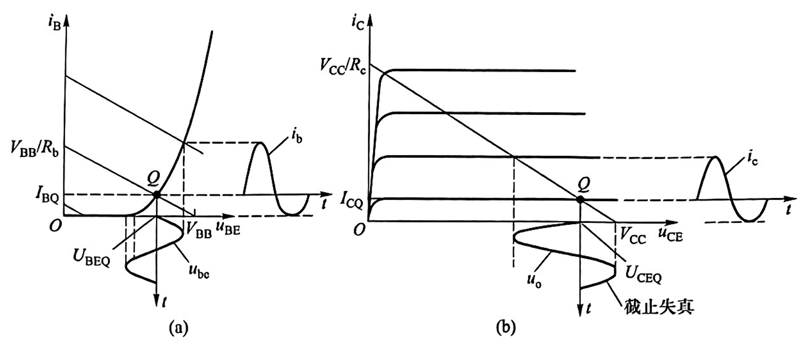
#### 饱和失真
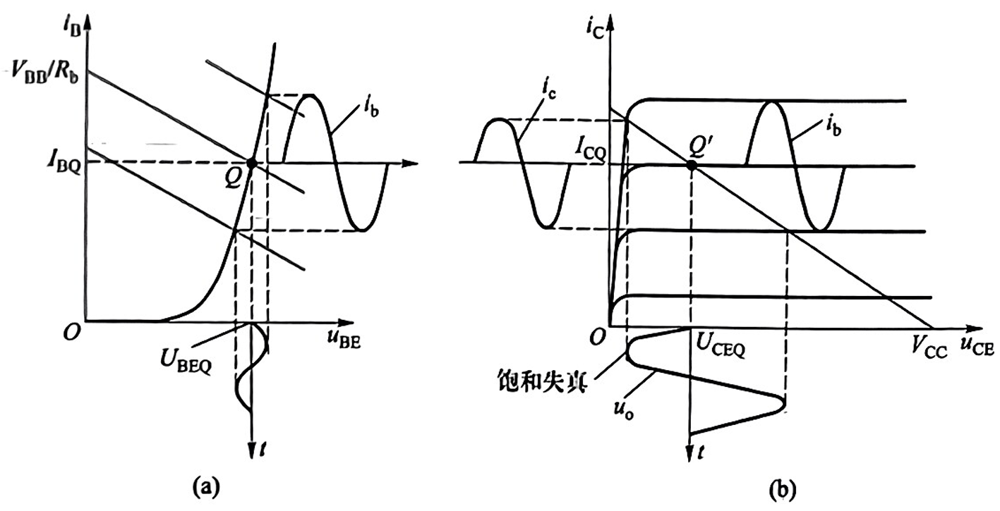
## 2.3.3 等效电路法
### 一、晶体管的直流模型及静态工作点的估算法
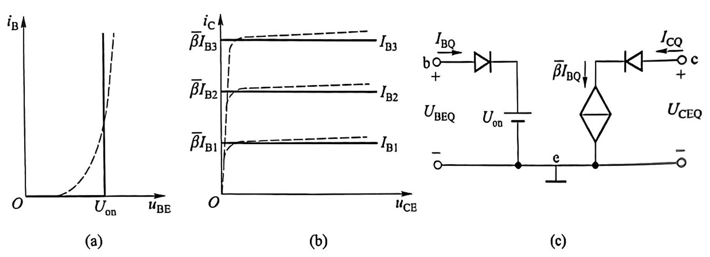
### 二、晶体管共射h参数等效模型
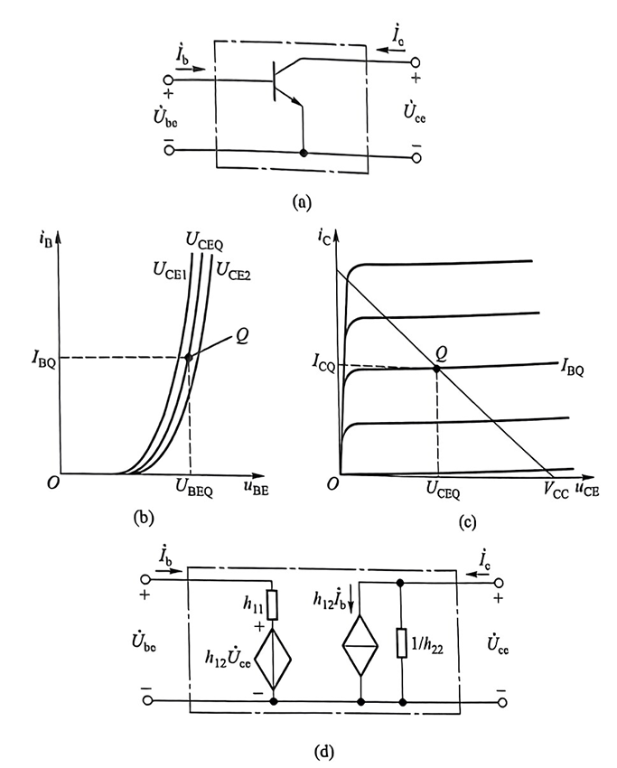
利用PN结的电流方程可求得
$$
r_{be}=\frac{U_{be}}{I_{b}}=r_{bb'}+r_{b'e}\approx r_{bb'}+(1+\beta)\frac{U_{T}}{I_{EQ}}
$$
#### 简化的h参数等效模型
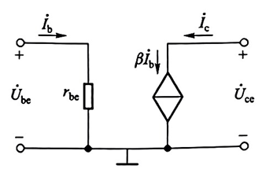
$$
\dot{I_{c}}=\beta \dot{I_{b}}
$$
# 2.4 放大电路静态工作点的稳定
## 一、温度对静态工作点的影响
在引起 Q 点不稳定的诸多因素中，温度对晶体管参数的影响是人为难以解决的。  
当环境温度升高时：  
1. 电流放大系数$β$增大；  
2. 穿透电流 $I_{CEO}$ 增大；  
3. 集中表现为集电极电流 $I_{CQ}$ 明显增大；  
4. 共射电路中晶体管的管压降 $U_{CEQ}$ 将减小；  
5. Q 点沿直流负载线上移到 Q′，向饱和区变化；  
6. 欲使之回到原来位置，必须减小基极电流 $I_{BQ}$。  
当温度降低时，Q 点将沿直流负载线下移，向截止区变化，必须增大 $I_{BQ}$ 才能维持 Q 点基本不变。  
结论：稳定 Q 点，通常是指在环境温度变化时静态集电极电流 $I_{CQ}$ 和管压降 $U_{CEQ}$ 基本不变，即 Q 点在晶体管输出特性坐标平面中的位置基本不变；必须依靠 $I_{BQ}$ 的变化来抵消 $I_{CQ}$ 和 $U_{CEQ}$ 的变化。
## 二、稳定原理
1. 电路组成与 Q 点稳定原理  
	1. 电路形式  
		图 2.4.2 (a) 直接耦合方式；  
		图 2.4.2 (b) 阻容耦合方式；  
		二者具有相同的直流通路，如图 2.4.2 (c) 所示。 
		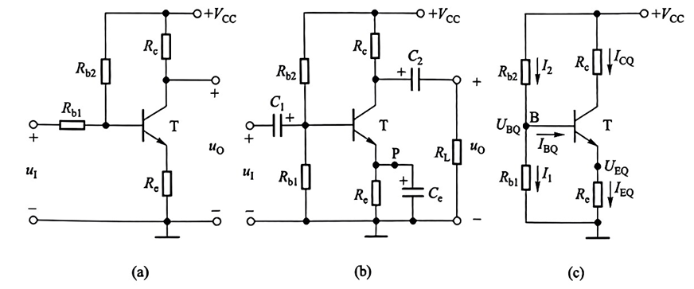
	2. 参数选取条件  
		   为稳定 Q 点，通常使 $I_1 ≫ I_{BQ}$  (2.4.1)  于是 $I_2≈I_1$，基极电位  $U_{BQ} ≈ \frac{R_b 2}{(R_b 1+R_b 2)}·V_{CC}$  (2.4.2) 
		    式 (2.4.2) 表明 $U_{BQ}$ 几乎仅由 $R_{b 1}、R_{b 2}$ 对 $V_{CC}$ 分压决定，与温度无关。
	3. 温度稳定性自动调节过程  
		   $T (℃)↑ → I_C↑ → I_E↑ → U_E↑ (因 U_BQ 基本不变) → U_BE↓ → I_B↓ → I_C↓$
		   结果：$I_C$ 随温度升高而增大的部分几乎被因 $I_B$ 减小而减小的部分抵消，$I_C$、$U_{CE}$ 基本不变，Q 点位置基本不变。  
	4. 反馈性质  
		   $R_e$ 将输出量 ($I_C$) 的变化转化为电压变化引回输入回路影响输入量 ($U_{BE}$)，使输出量变化减小——直流负反馈；$R_e$ 为直流负反馈电阻。  

3. 静态工作点的估算  
	已知条件：$I_1≫I_{BQ}$  
	1. 基极电位  
		$U_{BQ} = \frac{R_{b 2}}{(R_{b 1}+R_{b 2})}·V_{CC}$  
	2. 发射极电流  
		$I_{EQ} = \frac{U_{BQ} - U_{BEQ}}{R_e}$  (2.4.3)  
	3. 管压降  
		$U_{CEQ} ≈ V_{CC} - I_{CQ} (R_c + R_e)$  (2.4.4)  
	4. 基极电流  
		$I_{BQ} = \frac{I_{CQ}}{(1+β)}$  (2.4.5)  

5. 动态参数的估算  
	1. 有旁路电容 $C_e$（图 2.4.4 a）  
		电压放大倍数  
		$A_u = -\frac{β(R_c // R_L)}{r_{be}}$  (2.4.6 a)  
		输入电阻  
		$R_i = R_b 1 // R_b 2 // r_{be}$  (2.4.6 b)  
		输出电阻  
		$R_o = R_c$  (2.4.6 c)  
	2. 无旁路电容 C_e（图 2.4.4 b）  
		电压放大倍数  
		$A_u = -\frac{β(R_c // R_L)}{[r_{be} + (1+β) R_e]}$  (2.4.7 a)  
		输入电阻  
		$R_i = R_{b 1} // R_b 2 // [r_{be} + (1+β) R_e]$  (2.4.7 b)  
		输出电阻  
		$R_o = R_c$  (2.4.7 c)  
	3. 近似条件  
		若 $(1+β) R_e≫r_{be}$ 且 $7$，则  
		$|A_u| ≈ \frac{R_c // R_L}{R_e}$  (2.4.8)  
		此时电压放大倍数几乎仅取决于电阻取值，受温度影响很小，温度稳定性好。  
## 三、Q 点分析

1. 直流负反馈——典型电路已述。  
2. 温度补偿  
（1）利用二极管反向特性（图 2.4.6 a）  
温度$↑ → I_R↑ → I_D↑ → I_B↓ → I_C↓$，抵消 $I_C$ 的增大。 
（2）利用二极管正向压降（图 2.4.6 b）  
温度$↑ → U_D↓ → U_B↓ → U_BE↓ → I_B↓ → I_C↓$，同时具有直流负反馈作用。
# 2.5 晶体管单管放大电路的三种基本接法
## 一、基本共集放大电路

1. 电路组成  
	根据放大电路的组成原则，晶体管应工作在放大区，即 $u_{BE} > U_{on}，u_{CE} ≥ u_{BE}$。  
	图 2.5.1 (a) 中：  
	- 基极电源 $V_{BB}$ 与 $R_b、R_e$ 共同确定合适基极静态电流；  
	- 集电极电源 $V_{CC}$ 提供集电极电流和输出电流；  
	- 集电极为输入回路和输出回路的公共端。  
2. 静态分析（图 2.5.1 (b) 直流通路）  
	输入回路方程：  
	$$V_{BB} = I_{BQ} R_b + U_{BEQ}+ I_{EQ} R_e  
	= I_{BQ} R_b + U_{BEQ} + (1+β) I_{BQ} R_e$$
	解得：  
	$I_{BQ} = (V_{BB} - U_BEQ)/[R_b + (1+β) R_e]$  (2.5.1 a)  
	$I_{EQ} = (1+β) I_{BQ}$  (2.5.1 b)  
	$U_{CEQ} = V_{CC} - I_{EQ} R_e$  (2.5.1 c)  
3. 动态分析（图 2.5.2 交流等效电路）  
	1. 电压放大倍数  
		$A_u = (1+β) R_e / [R_b + r_be + (1+β) R_e]$ 
		结论：$A_u > 0$ 且 $A_u < 1$，$U_o$ 与 $U_i$ 同相；当 $(1+β) R_e ≫ R_b + r_{be}$ 时，$A_u ≈ 1$，称“射极跟随器”。  
	2.  输入电阻  
		$R_i = R_b + r_{be} + (1+β) R_e$  (2.5.3)  
		发射极电阻等效到基极回路增大到 (1+β) 倍，输入电阻可达几十～几百千欧。  
	3. 输出电阻  
		令 $U_i = 0$，输出端加电压 $U_o$，求得：  
		$R_o = R_e // \left[ \frac{R_b + r_{be}}{(1+β)} \right]$  (2.5.4)  
		基极回路电阻等效到发射极回路减小到 $\frac{1}{(1+β)}$，$R_o$ 可小至几十欧。  
4. 应用特点  
	输入电阻大、输出电阻小，从信号源索取电流小、带负载能力强；常用于多级电路的输入级、输出级或缓冲级。  
## 二、基本共基放大电路  
1. 电路组成  
	图 2.5.4 (a)：  
	- 发射结正偏：$V_{BB}$ 与 $R_e$ 确定 $I_{EQ}$；  
	- 集电结反偏：$V_{CC}$ 提供 $I_C$ 并输出信号；  
	- 基极为输入、输出公共端。  
2. 静态分析  
	$I_{EQ} = \frac{V_{BB} - U_{BEQ}}{R_e}$  (2.5.5 a)  
	$I_{BQ} = \frac{I_{EQ}}{(1+β)}$  (2.5.5 b)  
	$U_{CEQ} = V_{CC} - I_{CQ} R_c + U_{BEQ}$  (2.5.5 c)  

3. 动态分析（图 2.5.4 c 交流等效电路）  
	(1) 电压放大倍数  
	$A_u = \frac{β(R_c // R_L)}{[r_{be} + (1+β) R_e]}$  (2.5.6 a)  
	当 R_e 为信号源内阻时，A_u 数值与共射电路相同，有足够电压放大能力。  
	
	(2) 输入电阻  
	$R_i = R_e + \frac{r_{be}}{(1+β)}$  (2.5.6 b)  
	输入电阻小，可低至几百欧。  
	
	(3) 输出电阻  
	$R_o = R_c$  (2.5.6 c)  
	输出电阻与共射电路相当。  
3. 应用特点  
	只能放大电压不能放大电流；输入电阻小，高频特性好，常用于宽频带放大电路。  
## 三、三种接法比较

1. 共射：既能放大电流又能放大电压；输入电阻居中；输出电阻较大；频带较窄；常用作低频电压放大单元。  
2. 共集：只能放大电流不能放大电压；输入电阻最大、输出电阻最小；具有电压跟随特点；用于输入级、输出级、缓冲级。  
3. 共基：只能放大电压不能放大电流；输入电阻最小；高频特性最好；用于宽频带放大电路。
# 2.6 场效应管
## 2.6.1 场效应管放大电路的三种接法  
场效应管的源极、栅极和漏极与晶体管的发射极、基极和集电极相对应，因此在组成放大电路时也有三种接法：  
- 共源放大电路  
- 共漏放大电路  
- 共栅放大电路  

以 N 沟道结型场效应管为例，三种接法的交流通路如图 2.6.1 所示。`由于共栅电路很少使用，本节只对共源和共漏两种电路进行分析。`
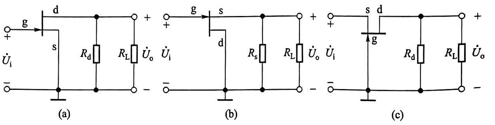

## 2.6.2 场效应管放大电路静态工作点的设置方法及分析估算  
1. 基本共源放大电路  
   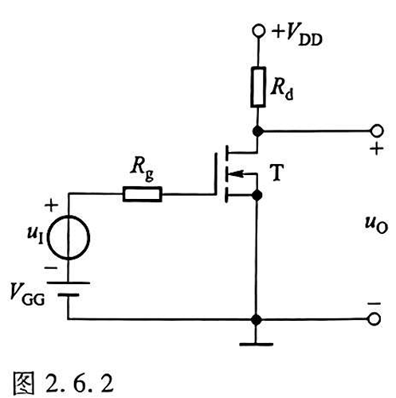
	图 2.6.2 所示共源放大电路采用 N 沟道增强型 MOS 管，为使它工作在恒流区：  
	- 输入回路加栅极电源 $V_{GG}$，且 $V_{GG}$ > 开启电压 $U_{GS (th)}$  
	- 输出回路加漏极电源 $V_{DD}$，保证 $u_{DS}$ > 预夹断电压，同时作为负载能源  
	- $R_d$ 作用与共射电路中的 $R_c$ 完全相同，将漏极电流 $i_D$ 的变化转换成电压 $u_{DS}$ 的变化，实现电压放大  
	
	静态分析：  
	令 $U_i = 0$，由于栅-源之间绝缘，栅极电流为 0，故  
	$U_{GSQ} = V_{GG}$
	若已知场效应管输出特性曲线，可作负载线 $u_{DS} = V_{DD}- i_D R_d$，与 $U_{GS} = V_{GG}$ 曲线交点即为 $Q$ 点，读出 $I_{DQ}、U_{DSQ}$
	
	也可用电流方程计算：  
	$I_{DQ} = I_{DO} \left( \frac{V_{GG}}{U_{GS (th)} - 1}  \right)²$  (2.6.1)  
	$U_{DSQ} = V_{DD} - I_{DQ} R_d$  (2.6.2)  
	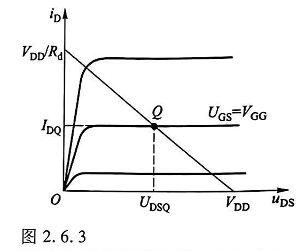
2. 自给偏压电路  
	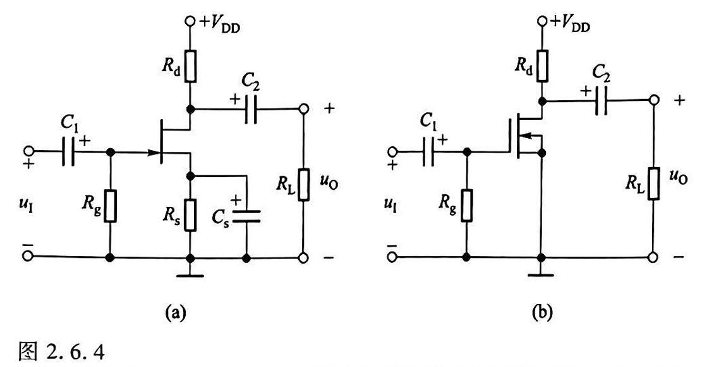
	图 2.6.4 (a) 为 N 沟道结型场效应管共源放大电路，是典型的自给偏压电路。  
	静态时：  
	- 栅极电流为 0，$R_g$ 电流为 0，栅极电位 $U_{GQ}$= 0  
	- 漏极电流 $I_{DQ}$ 流过源极电阻 $R_s$，使源极电位 $U_{SQ} = I_{DQ} R_s$ 
	- 故栅-源静态电压：$U_{GSQ} = U_{GQ} - U_{SQ} = -I_{DQ} R_s$   (2.6.3)  
	电路靠源极电阻上的电压为栅-源提供负偏压，故称"自给偏压"  
	
	联立电流方程：  
	$I_{DQ} = I_{DSS} \left( 1 - \frac{U_{GSQ}}{U_{GS} (off)}  \right)²$  (2.6.4)  
	$U_{DSQ} = V_{DD} - I_{DQ} (R_d + R_s)$  (2.6.5)  
	
	图 2.6.4 (b) 为耗尽型 N 沟道 MOS 管特例，$U_{GSQ} = 0$，求解时先在转移特性上找 $U_{GS} = 0$ 时的 $I_{DQ}$，再用式 (2.6.2) 求 $U_{DSQ}$ 
1. 分压式偏置电路  
	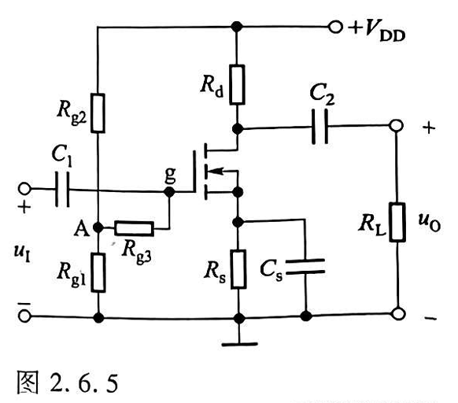
	图 2.6.5 为 N 沟道增强型 MOS 管构成的共源放大电路，$R_{g 1}$ 与 $R_{g 2}$ 对 $V_{DD}$ 分压设置偏压，故称"分压式偏置电路"  
	静态时：
	$U_{GQ} = \left( R_g \frac{1}{(R_{g 1} + R_{g 2})} \right) V_{DD}$  
	$U_{SQ} = I_{DQ} R_s$  
	故：  
	$U_{GSQ} = U_{GQ} - U_{SQ} = (R_g 1 / (R_g 1 + R_g 2)) V_{DD} - I_{DQ} R_s$(2.6.6)  
	联立式 (1.4.5) 电流方程可解 $I_{DQ}、U_{GSQ}$，再用式 (2.6.5) 求 $U_{DSQ}$  
	
	$R_g$ 可取几兆欧以增大输入电阻，但阻值越大噪声越大，故 $R_g$ 不宜过大  
## 2.6.3 场效应管放大电路的动态分析  
1. 场效应管的低频小信号等效模型  
	将场效应管看成两端口网络：  
	- 栅-源为输入端口，栅极电流为零，仅存在电压 $U_{gs}$  
	- 漏-源为输出端口，漏极电流 $i_D$是 $u_{GS}$ 和 $u_{DS}$ 的函数： $i_D = f (u_{GS}, u_{DS})$ 
	
	在 Q 点附近小信号作用时：  
	$di_D = \left( \frac{∂i_D}{∂u_{GS}} \right)|U_{DS} dU_{GS} + \left( \frac{∂i_D}{∂u_{DS}} \right)|U_{GS} dU_{DS}$ 
	令：  
	$g_m = \frac{∂i_D}{∂u_GS}|_{U_{DS}}$  (2.6.8) 
	$\frac{1}{r_{ds}} = \frac{∂i_D}{∂u_{DS}}|_{U_{GS}}$  (2.6.9)  
	
	用交流量表示：  
	$I_d = g_m U_{gs} + \frac{U_{ds}}{r_{ds}}$  (2.6.10)  
	
	等效模型：  
	- 输入回路栅-源之间等效为开路  
	- 输出回路为电压 $U_{gs}$ 控制的电流源 $g_m$ $U_{gs}$ 与电阻 $r_{ds}$ 并联  
	
	$g_m$ 称为跨导，可从转移特性曲线求出： 
	
	$g_m = 2\sqrt{ \frac{I_{DO} I_{DQ}}{U_{GS (th)}} }$   (2.6.11)  
	表明 $g_m$ 与 $Q$ 点密切相关，$Q$ 点越高，$g_m$ 越大  
1. 基本共源放大电路的动态分析  
	图 2.6.8 交流等效电路（采用简化模型，$r_{ds} = ∞$）：  
	电压放大倍数：  
	$A_u = -g_m (R_d // R_L)$  (2.6.12 a)  
	输入电阻：  
	$R_i = ∞$  (2.6.12 b)  
	输出电阻：  
	$R_o = R_d$  (2.6.12 c)  
	
	共源电路具有电压放大能力，输出与输入反相，输入电阻远大于共射电路  
2. 基本共漏放大电路的动态分析  
	图 2.6.9 (a) 电路，图 (b) 交流等效电路：  
	电压放大倍数：  
	$A_u = \frac{g_mR_s}{(1 + g_m R_s)}$  (2.6.13)  
	输入电阻：  
	$R_i = ∞$  (2.6.14)  
	输出电阻（输入短路，输出加电压）：  
	$R_o = R_s // (1/g_m)$  (2.6.15)  
	
	当$g_m R_s ≫ 1$ 时，$A_u ≈ 1$，具有电压跟随特点，称"源极跟随器"；输出电阻较小  

## 2.6.4 场效应管放大电路的特点与应用  
场效应管（单极型）与晶体管（双极型）相比，最突出优点：  
- 可组成高输入电阻放大电路（输入电阻可达 $10^7～10^{12} Ω$）  
- 噪声低、温度稳定性好、抗辐射能力强  
- 便于集成化，构成低功耗电路  
因此广泛应用于：  
- 高输入阻抗放大器输入级  
- 低噪声放大电路  
- 抗辐射环境下的放大电路  
- 大规模集成电路中的放大单元